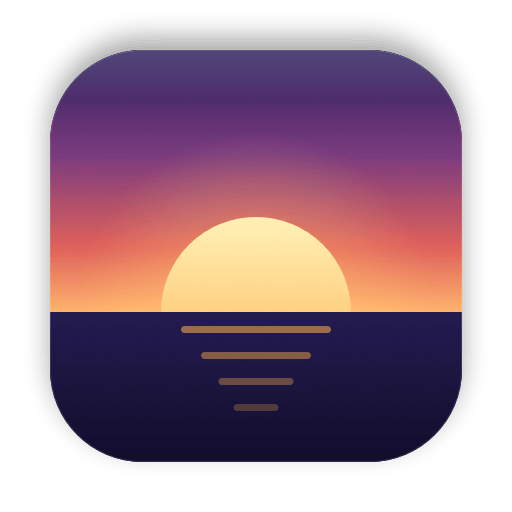

<p align="center">
  
</p>

<h1 align="center">DuskBar</h1>

<p align="center">
  A tiny, native menu bar app that warms your screen with the real sun.
</p>

<p align="center">
  <a href="https://github.com/laurenschristian/duskbar/releases/latest"></a>
  
  
  <a href="LICENSE"></a>
</p>

## Overview

DuskBar replaces f.lux. It follows the sun's elevation at your location, the light in your room and, if you want, the clouds. It is plain AppKit with no dependencies. It does no work between color changes: it computes when the next change starts and sleeps until then.

## Performance

Measured on macOS 26, M3 Max:

| Metric | DuskBar 1.0.0 | f.lux 42.2 |
| --- | --- | --- |
| Memory footprint | 11 MB | 85 MB |
| Idle CPU | 0.0% | 0.2% |
| Idle wakeups | 0 per minute | |
| App bundle | 632 KB (universal) | 3.1 MB |
| Network | None unless Weather is on | Update checks |

## Features

- **Sun elevation curve.** Day above +3 degrees, night below -6 degrees (civil twilight), a smooth blend between. Works in polar day and polar night.
- **Bedtime.** A warmer late-night color from bedtime until your wake time.
- **Morning blue boost.** Optional 7000K for 30 minutes after dawn or wake time.
- **Travel.** When the time zone changes, DuskBar takes one location fix and moves the schedule. No manual edits after a flight.
- **Ambient light.** In a dark room the evening starts earlier and the screen dims 20%.
- **Weather.** Optional. Above 80% cloud cover, the evening starts about 30 to 45 minutes earlier.
- **Pause.** For 1 hour, until sunrise, for chosen apps, or for fullscreen apps.
- **Effects.** Darkroom (red, inverted), dim below minimum brightness, grayscale, Soft White and Ember presets.
- **Evening extras.** Dark Mode at sunset, backlight and keyboard dimming at night, bedtime reminders.
- **Control.** A temperature slider in the menu, global hotkeys, and a `duskbar://` URL scheme for Shortcuts and Raycast.
- **Safety.** Warns when another app changes screen color, when Night Shift is on, and for displays that ignore color tables.
- **f.lux import.** On first launch, DuskBar copies your f.lux temperatures and wake time.

## Requirements

- macOS 13 Ventura or later

## Installation

### Homebrew (recommended)

```sh
brew install --cask laurenschristian/tap/duskbar
xattr -dr com.apple.quarantine /Applications/DuskBar.app
```

### Manual download

1. Download the latest `DuskBar-vX.Y.Z.dmg` from [Releases](https://github.com/laurenschristian/duskbar/releases/latest).
2. Open the disk image and drag DuskBar to Applications.
3. Run `xattr -dr com.apple.quarantine /Applications/DuskBar.app`.

> [!NOTE]
> DuskBar is not notarized by Apple yet, so Gatekeeper blocks the first launch. The `xattr` command removes the download quarantine flag.

If f.lux is running, quit it first. Two apps that set screen color fight each other.

## Usage

Click the menu bar icon. The top lines show the current color, the next change, and the location in use.

| Icon | Meaning |
| --- | --- |
| Sun | Day |
| Sunset | Evening color |
| Moon | Bedtime |
| Slashed circle | Paused |
| Triangle | Another app is changing screen color |

### Hotkeys

| Shortcut | Action |
| --- | --- |
| ⌥⌘End | Pause for 1 hour, or resume |
| ⌥⌘PageUp | 200K warmer for the current phase |
| ⌥⌘PageDown | 200K cooler for the current phase |
| ⌥⌘Home | Darkroom on or off |

On a MacBook keyboard, End is Fn+Right, Home is Fn+Left, PageUp is Fn+Up and PageDown is Fn+Down.

### URL scheme

| URL | Action |
| --- | --- |
| `duskbar://disable?minutes=60` | Pause for N minutes (default 60) |
| `duskbar://enable` | Resume the schedule |
| `duskbar://temp?k=2700&minutes=30` | Hold a temperature for N minutes |
| `duskbar://effect?name=darkroom&on=1` | Darkroom, dim or grayscale; omit `on` to toggle |
| `duskbar://bedtime?on=1` | Bedtime color now, until wake time |

### Sleep Focus

To start bedtime when Sleep Focus turns on:

1. Open Shortcuts and go to Automation.
2. Add a Personal Automation: When Sleep turns on, run immediately.
3. Add the action Open URLs with `duskbar://bedtime?on=1`.
4. Add a second automation for When Sleep turns off with `duskbar://bedtime?on=0`.

### Location

DuskBar picks the location in this order:

1. A location you set in Location > Set Location.
2. A one-time location fix, taken at launch and after a time zone change.
3. The reference city of your time zone, from `/usr/share/zoneinfo/zone.tab`.

The location stays on your Mac. With Weather on, DuskBar sends the location rounded to 0.1 degree to [Open-Meteo](https://open-meteo.com) once an hour.

## Troubleshooting

- **Another app is changing screen color.** f.lux, Lunar, BetterDisplay, MonitorControl or Night Shift also write the display color table. Quit the other app or turn off its color feature.
- **Night Shift is on.** Night Shift and DuskBar stack, so the screen gets twice as warm. Turn off Night Shift in System Settings > Displays.
- **Display not supported.** Sidecar, AirPlay and DisplayLink displays ignore color tables.
- **M5 Pro and M5 Max.** On macOS 26.3.1 and later, macOS ignores color table changes on these chips. This affects every app of this type. See [Apple forum thread 819331](https://developer.apple.com/forums/thread/819331).
- **XDR brightness upscaling** in BetterDisplay does not work together with any color table app.
- **Screen stays tinted after a crash.** It cannot: macOS resets the color when the process exits, also after `kill -9`.

## How it works

DuskBar computes the sun's elevation with the NOAA solar position algorithm. It converts the target temperature to RGB with the same method as the Redshift table (Planckian locus below 5000K, CIE daylight above 6500K, sRGB encoded) and writes a 256-entry table to each display with `CGSetDisplayTransferByTable`. One timer fires at the next change; during a fade it steps every 10 seconds. The light sensor, when on, is read every 30 seconds from the IORegistry.

Backlight, keyboard, grayscale and the Night Shift check use private Apple frameworks, loaded at runtime. If a macOS update removes one, only that feature turns off.

## Building from source

Building requires Xcode or the Xcode Command Line Tools.

```sh
git clone https://github.com/laurenschristian/duskbar.git
cd duskbar
./build.sh install
```

| Command | Result |
| --- | --- |
| `./build.sh` | Builds `build/DuskBar.app` (universal) |
| `./build.sh install` | Builds, installs to `/Applications`, and launches |
| `./build.sh release` | Builds `build/DuskBar-v<version>.dmg` and prints its SHA-256 |
| `./build.sh test` | Runs the unit tests, then the perf gates on the installed app |
| `swift test` | Unit tests only |
| `swift scripts/make-icon.swift` | Regenerates `icon.png` and `Resources/AppIcon.icns` |

Set `SIGN_IDENTITY` to sign with your own certificate. The default is ad-hoc.

## Uninstalling

```sh
brew uninstall --zap --cask duskbar
```

For a manual install, quit DuskBar, delete `/Applications/DuskBar.app`, and run `defaults delete com.laurenschristian.duskbar`.

## License

DuskBar is released under the [MIT License](LICENSE).
